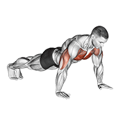
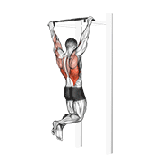
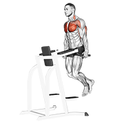
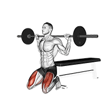
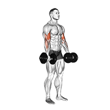
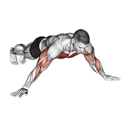

# 🏋️‍♂️ Training Hub - Home Workout App

[](https://github.com/mihretu-dev/HomeWorkoutApp/releases)
[](https://kotlinlang.org)
[](https://developer.android.com)

A modern, offline-first Android fitness application built with Kotlin and Jetpack Compose. Designed for custom workout tracking, guided exercise execution, live rest timers, and personal record tracking.

Developed by **Mihretu Hizkel (mihretu-dev)** • Contact: mihretuhizkel380@gmail.com

---

## 🎥 Exercise Demonstrations & Visuals

| Push-Ups | Pull-Ups | Dip Station |
| :---: | :---: | :---: |
|  |  |  |
| **Push-Ups** | **Pull-Ups** | **Chest / Tricep Dips** |

| Barbell Back Squat | Dumbbell Bicep Curl | Archer Push-Ups |
| :---: | :---: | :---: |
|  |  |  |
| **Barbell Back Squat** | **Dumbbell Bicep Curl** | **Archer Push-Ups** |

---

## 🔥 Key Features

- **44+ Exercises Library:** Comprehensive coverage of Bodyweight, Dumbbell, Barbell, Pull-Up Bar, and Dip Station exercises with offline human athlete demonstration GIFs.
- **Smart Filtering & Search:** Search exercises in real time and filter by Target Muscle Group or Equipment with multi-selection support.
- **Custom Routine Management:** Expandable routine cards with step-by-step exercise breakdowns, custom exercise reordering, and full edit capabilities.
- **Guided Active Workouts & Get-Ready Countdown:** Step-by-step workout execution queue with live interactive timers, 3-second get-ready countdown, rest countdowns, and haptic/sound cues.
- **AI Voice Coach:** TextToSpeech spoken countdowns, exercise start guidance, rest announcements, and completion celebrations.
- **Customizable Daily Workout Reminders:** Time Picker, workout day selectors (M..S), and motivational notification styles powered by WorkManager.
- **Form Guides & History:** Detailed exercise instruction screens featuring historical log data (Reps, Weight, Max Hold) and PR tracking.
- **Offline & Private:** 100% local data persistence using Room DB and WorkManager.

---

## 🛠️ Tech Stack

- **UI:** Jetpack Compose, Material 3 (Dark Theme + Electric Lime Accents)
- **Architecture:** MVVM, Clean Architecture
- **Database:** Room DB (Offline First)
- **Image/GIF Loading:** Coil
- **Voice Engine:** Android TextToSpeech (TTS)
- **Background Work:** WorkManager
- **Language:** 100% Kotlin

---

## 📲 Download & Installation

[](https://github.com/mihretu-dev/HomeWorkoutApp/releases)

1. **Direct APK Download**: Tap the badge above or visit the [Releases Page](https://github.com/mihretu-dev/HomeWorkoutApp/releases) to download `app-production-release.apk`.
2. **Build from Source**:
   ```bash
   git clone https://github.com/mihretu-dev/HomeWorkoutApp.git
   cd HomeWorkoutApp
   ./gradlew installDevelopmentDebug
   ```
